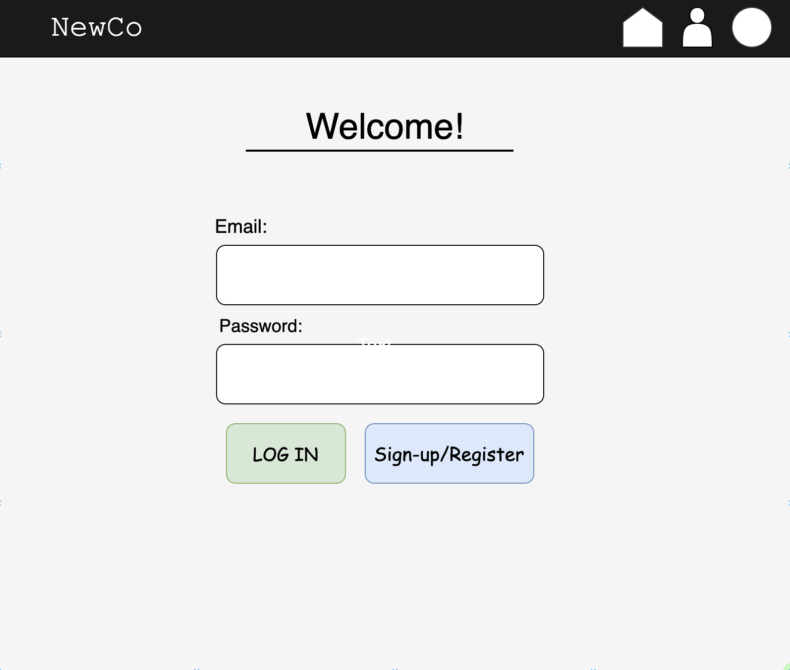
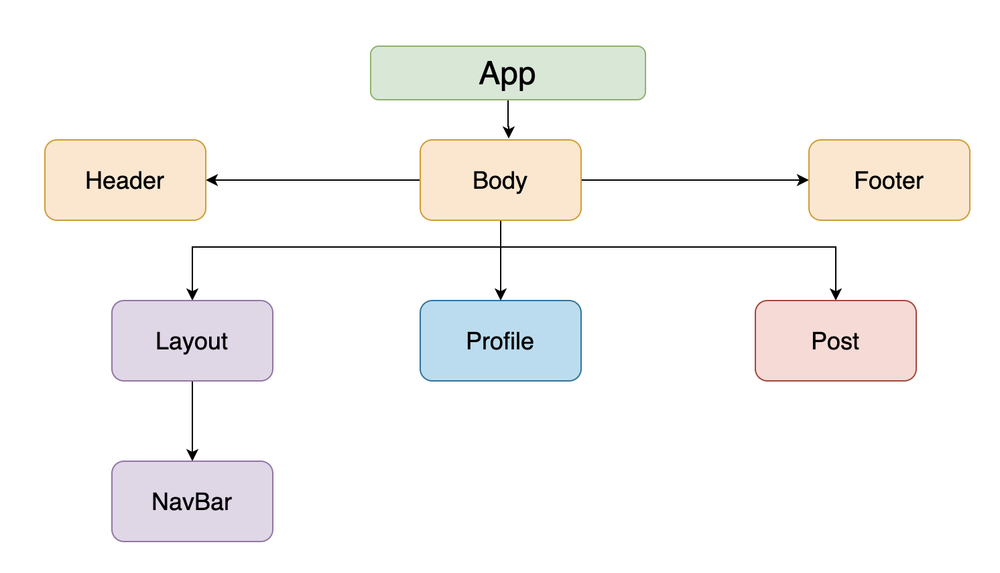

# NewCo.

#### _05/22/2020_

#### _By Jonathan Carlos_

## **Description**

NewCo. is a social networking platform that will allow users to sign-up, add friends, and post different types of content such as images and comments in an effort to innovate the next generation of online socializing. The current status of the application is a finished API using Firebase and Firestore.

## **Minimum Viable Product (MVP)**

* Feature that allows a user to post and delete a message.
* Feature that allows a user to comment on other people’s posts.
* Feature that allows a user to to 'like' or 'dislike' someone else's comment.

Stretch goals include:

* User Registration / Sign-Up Feature - A user's account log-in information will be held in database storage.
* Log-in / Log-out Feature - A user will be able to log in and out of their account using database authentication.
* Notifications - A user will be notified when someone interacts with their posts.
* Sort Newsfeed in Ascending Timestamp Order - The most recent posts will show on the newsfeed.
* Videos / Images - A user will be able to post an image or a video.
* Share - A user will be able to share someone else's post.

## Preview

  

## Specifications

  

 

## **Setup/Installation**

*Option One:*
1. Open up your terminal.
2. Navigate to the desired directory in which you want to clone this repository.
3. Use `git clone https://github.com/jamestlalocPDX/epicodus-capstone-backend` to clone this repository.
4. Cd into `epicodus-capstone-backend`.
5. Open the repository using `code .` .
6. Install all dependencies using `$ npm install` in your terminal.
7. Use `$ npm run build` to start a package bundle.
8. Use `$ npm run start` in your terminal for a live development server.

## **Known Bugs**

No known bugs at this time.

## **Support and Contact Details**

If you have any questions, comments, or concerns, feel free to contact the application creator at examplemail@company.net 

## **Technologies Used**

* Node.js

* Express

* Javascript

* React

* Redux

* Firebase / Firestore

* Postman

* Git 2.23.0

* Webpack 

* CSS

* Visual Studio Code 1.43.1

* GitBash

## **License**

Copyright (c) 2020 **_NewCo._**

This software is licensed under the MIT license.